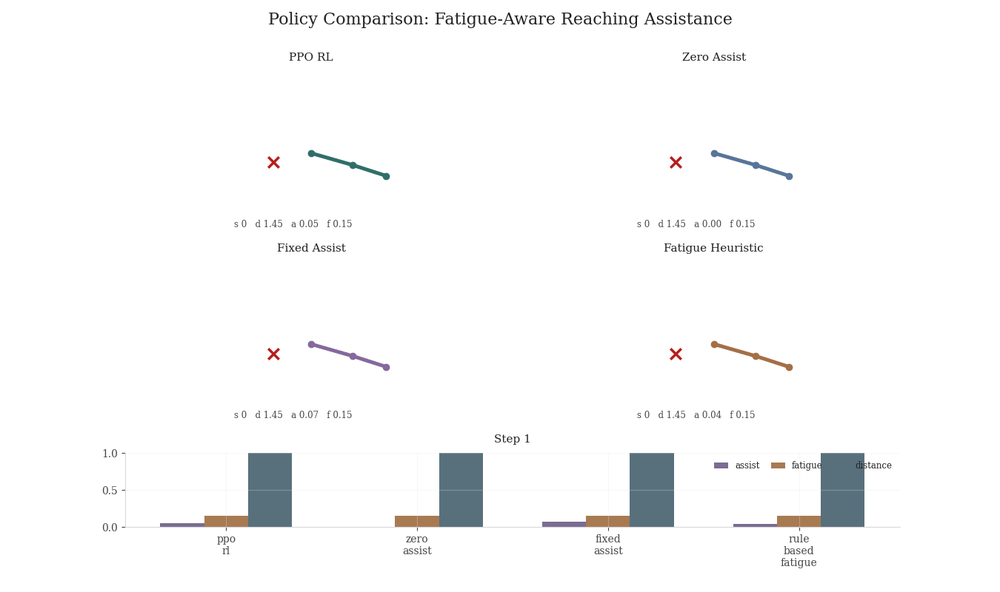
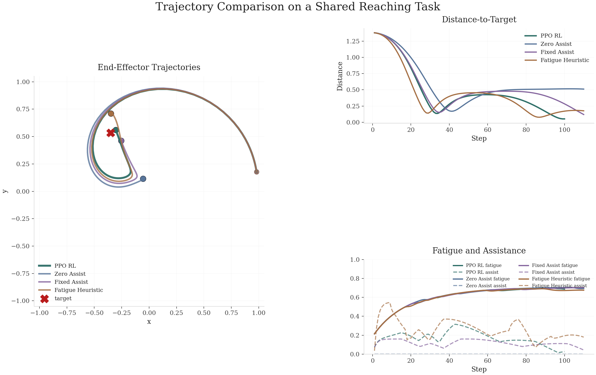
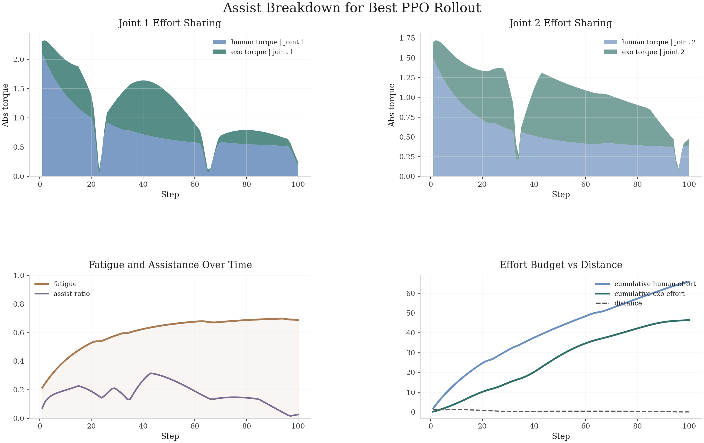
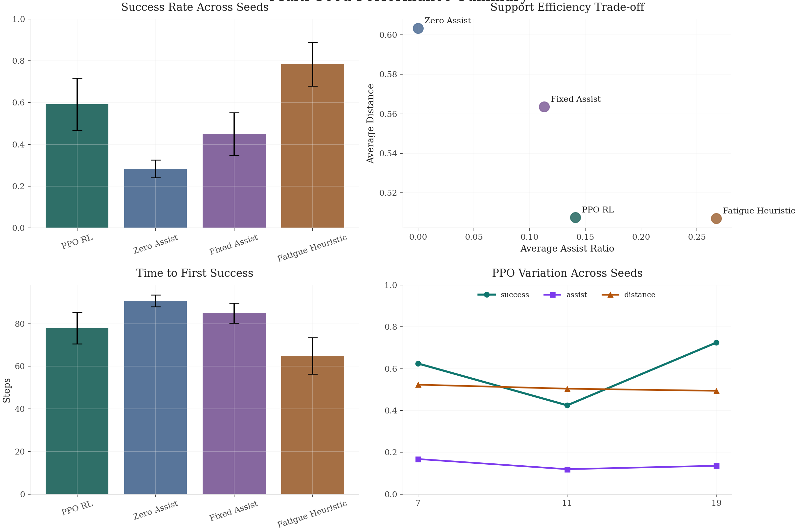

# Fatigue-Aware Assist-as-Needed Exoskeleton RL

Assist-as-needed reinforcement learning for an upper-limb exoskeleton control simulator. A fatigue-limited user model performs 2D reaching while accumulating effort and fatigue; the policy learns how much target-aligned assistance to provide without defaulting to full takeover.

## Project contribution

- Built a self-contained closed-loop exoskeleton control environment for fatigue-aware reaching assistance.
- Trained a PPO policy that improves reaching reliability over `zero_assist` and `fixed_assist` baselines.
- Evaluated the policy with multi-seed experiments, behavioral comparisons, and effort-sharing analysis.
- Produced headless portfolio artifacts as `PNG`, `GIF`, and `MP4` without ROS, MuJoCo, or GUI rendering.

## Headline result

Latest multi-seed sweep on `seeds = [7, 11, 19]`:

- PPO RL: `success = 0.592 ± 0.125`
- Zero assist: `success = 0.283 ± 0.042`
- Fixed assist: `success = 0.450 ± 0.102`
- Fatigue heuristic: `success = 0.783 ± 0.105`
- Best PPO seed: `19`

Result summary: PPO improves reaching reliability over both `zero_assist` and `fixed_assist`, while remaining more assist-efficient than the fatigue-threshold heuristic in the stronger runs. The heuristic remains the strongest hand-crafted reference, but PPO closes a substantial part of that gap with a learned policy.



## Visual highlights

### 1. Behavioral comparison

Figure 1. Shared-target behavioral comparison across PPO and baseline controllers. PPO shows more directed task-space motion than `zero_assist`, while avoiding the heavier intervention profile of the fatigue heuristic.



### 2. Assist-as-needed evidence

Figure 2. Effort-sharing breakdown for the selected PPO rollout. Exoskeleton support rises when task demand and fatigue accumulate, but does not collapse into full takeover, which is the core assist-as-needed behavior targeted here.



### 3. Multi-seed robustness

Figure 3. Aggregate multi-seed summary over `seeds = [7, 11, 19]`. The plot reports mean and spread across seeds, showing that the PPO advantage over `zero_assist` and `fixed_assist` is not tied to a single run.



## What the environment models

- 2-link planar arm reaching
- User-side controller with torque limits, fatigue, and recovery
- Exoskeleton assistance as a `2D gain` in `[0, 1]`
- Reward based on reach progress, task completion, effort, fatigue, assist cost, and smoothness

The environment is designed as a tractable closed-loop testbed for adaptive assistive control and simulation-based decision making. It emphasizes interpretable control structure, reproducible evaluation, and clear policy-to-behavior analysis.

## Repository structure

```text
src/exo_rl/envs/         environment, dynamics, fatigue, user model, reward
src/exo_rl/agents/       PPO policy and training loop
src/exo_rl/baselines/    zero, fixed, and fatigue-threshold baselines
src/exo_rl/eval/         evaluation and metrics
src/exo_rl/viz/          figures, GIF/MP4 renderers, comparison visuals
src/exo_rl/experiments/  multi-seed sweep runner
configs/                 validated train/eval configs
scripts/                 terminal-friendly wrappers
tests/                   smoke tests
```

## Quick start

Install:

```bash
python3 -m pip install -e .
```

Train, evaluate, and render the default run:

```bash
bash scripts/train.sh
bash scripts/eval.sh
bash scripts/render_examples.sh outputs/models/best.pt
```

Run the validated multi-seed sweep:

```bash
bash scripts/sweep_seeds.sh configs/default.json outputs_sweep_default 40 7 11 19
```

## Key outputs

Primary run:

- `outputs/models/best.pt`
- `outputs/eval/metrics_summary.json`
- `outputs/figures/training_dashboard.png`
- `outputs/figures/assist_breakdown.png`
- `outputs/figures/trajectory_comparison.png`
- `outputs/videos/policy_episode.gif`
- `outputs/videos/policy_comparison.gif`

Selected best run:

- `outputs_sweep_default/seed_19/models/best.pt`
- `outputs_sweep_default/seed_19/videos/policy_episode.mp4`
- `outputs_sweep_default/seed_19/videos/policy_comparison.mp4`
- `outputs_sweep_default/figures/multiseed_summary.png`
- `outputs_sweep_default/summary.json`
- `outputs_sweep_default/summary.md`

## Configs

- `configs/default.json`: main portfolio configuration
- `configs/iteration.json`: shorter iteration config
- `configs/verification.json`: short verification config
- `configs/portfolio_best.json`: longer run variant used during tuning

Legacy aliases are still kept for compatibility:

- `configs/ppo_small.json`
- `configs/smoke_test.json`

## Reproducibility

- Fixed seeds via config
- Self-contained experiment setup
- No GUI dependency
- CPU-compatible; uses GPU if available
- All figures and videos generated directly from the evaluation pipeline
# fatigue-aware-exo-rl
# fatigue-aware-exo-rl
# fatigue-aware-exo-rl
# fatigue-aware-exo-rl
